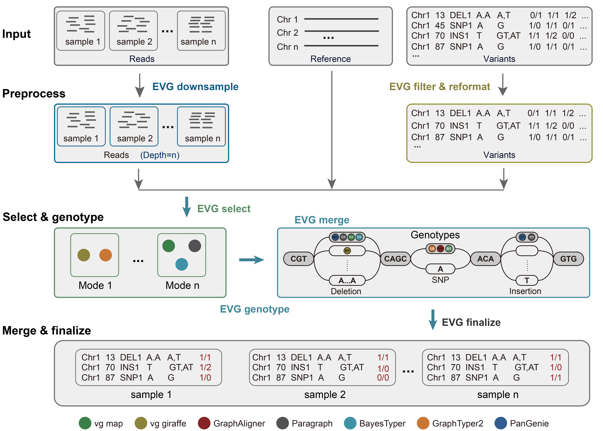

# EVG

[](https://github.com/JiaoLab2021/EVG/releases)
[](https://anaconda.org/DuZeZhen/evg)
[](https://github.com/JiaoLab2021/EVG/releases)
[](https://github.com/JiaoLab2021/EVG/actions)

## Introduction

A comprehensive benchmark of graph-based genetic variant genotyping algorithms on plant genomes for creating an accurate ensemble pipeline



## Requirements

[VG_url]: https://github.com/vgteam/vg
[GraphAligner_url]: https://github.com/maickrau/GraphAligner
[Paragraph_url]: https://github.com/Illumina/paragraph
[BayesTyper_url]: https://github.com/bioinformatics-centre/BayesTyper
[GraphTyper2_url]: https://github.com/DecodeGenetics/graphtyper
[PanGenie_url]: https://github.com/eblerjana/pangenie

Please note the following requirements before building and running the software:

* `Linux` operating system
* cmake version `3.12` or higher
* Python version `3.6` or higher
* C++ compiler that supports `C++17` or higher, and the `zlib` library installed (we recommend using GCC version `"7.3.0"` or newer) for building `graphvcf` and `fastAQ`
* The following dependencies must also be installed: [VG][VG_url], [GraphAligner][GraphAligner_url], [Paragraph][Paragraph_url], [BayesTyper][BayesTyper_url], [GraphTyper2][GraphTyper2_url], [PanGenie][PanGenie_url]

## Installation

**Install via Anaconda**

The easiest way to install EVG is through Anaconda, but please note that in this case, the Python version must be `3.9`. Conda will automatically set the Python version for you, so please ensure that your system can install Python `3.9`.

```shell
# Create a new environment named evg_env
conda create -n evg_env
# Activate the environment
conda activate evg_env
# Install EVG with all dependencies
conda install -c bioconda -c conda-forge -c kdm801 -c duzezhen evg
```

**Building on Linux**

Use the following script to build the software:

1. First, obtain the source code.

```shell
git clone https://github.com/JiaoLab2021/EVG.git
cd EVG
```

2. Next, compile the software and add the current directory to your system's `PATH` environment variable. Please make sure that `EVG`, `graphvcf`, and `fastAQ` are all in the same folder, as `EVG` will call these two programs from its own directory.

```shell
cmake ./
make
chmod +x EVG.py
ln -sf EVG.py EVG
echo 'export PATH="$PATH:'$(pwd)'"' >> ~/.bashrc
source ~/.bashrc
```

3. Assuming that you have installed all the required software dependencies, please make sure they have been added to your environment path or activated in the corresponding code environment. If you haven't installed them yet, you can use the following code to install all the dependencies:

```shell
# Create a new environment named evg_env
conda create -n evg_env
# Activate the environment
conda activate evg_env
# Install software using conda
conda install -c bioconda -c conda-forge -c kdm801 vg graphaligner paragraph bayestyper graphtyper kmc pangenie
# "ModuleNotFoundError: No module named 'pysam.bcftools'", therefore it is recommended to upgrade pysam in this case
conda update pysam
```

**Test**

To verify that the software has been installed correctly, perform a test run using the following steps:

```shell
EVG -h
graphvcf -h
fastAQ -h
vg -h
GraphAligner -h
paragraph -h
bayesTyper -h
graphtyper -h
PanGenie -h
kmc -h
jellyfish -h
# test
cd test
EVG -r test.fa -v test.vcf.gz -s sample.txt --software VG-MAP VG-Giraffe GraphAligner Paragraph BayesTyper GraphTyper2 PanGenie &>log.txt &
```

## Usage

**Input Files**

* Reference Genome
* VCF File of Population Variants
* Sample File:

```shell
# Sample File
sample1 path_to_sample1_read1 path_to_sample1_read2
sample2 path_to_sample2_read1 path_to_sample2_read2
...
sampleN path_to_sampleN_read1 path_to_sampleN_read2
```

Please note that the Sample file must be formatted exactly as shown above, where each sample is listed with its corresponding read files.

**Running**

For convenience, let's assume the following file names for the input:

* `refgenome.fa`
* `input.vcf.gz`
* `sample.txt`

`EVG` automatically selects suitable software based on the genome, mutation and sequencing data. If desired, users can also use the `"--software"` command to specify their preferred software. The default running command is as follows:

```shell
EVG -r refgenome.fa -v input.vcf.gz -s sample.txt
```

The results are stored in the `merge/` folder, and each file is named after the corresponding sample listed in `sample.txt`: `sample1.vcf.gz`, `sample2.vcf.gz`, ..., `sampleN.vcf.gz`.

```shell
$ tree merge/
merge/
├── test1.vcf.gz
└── test2.vcf.gz

0 directories, 2 files
```

**Parameter**

* `--depth`: This parameter specifies the maximum sequencing data depth allowed for downstream analysis. If this value is exceeded, EVG will randomly downsample reads to the specified level in order to speed up the run. The default downsampling level is set at 15×, but it can be adjusted to meet specific requirements.
* `--mode`: This parameter determines the operating mode of `EVG`. In fast mode, only certain software is utilized to genotype SNPs and indels, while precise mode employs all software to genotype all variants.
* `--force`: If there are pre-existing files in the running directory of `EVG`, this parameter can be used to forcibly empty the folder. Otherwise, the software will encounter an error and exit.
* `--restart`: This parameter allows the software to resume from where it left off if it unexpectedly stops, enabling a breakpoint restart. Note that software completion is determined by file existence. It's recommended to manually check for incomplete or empty files before using this parameter and delete them.

**graphvcf**

If you already have results from different genotyping software and do not need to use EVG, you can directly use `graphvcf` to merge your results.

```shell
graphvcf merge -v merged.vcf.gz --Paragraph xx.vcf.gz --BayesTyper xx.vcf.gz --VG-Giraffe xx.vcf.gz -n sample1 -o sample.vcf.gz
```

## Citation

[article_url]: https://www.biorxiv.org/content/10.1101/2023.07.19.549631v1

Please cite:

[A comprehensive benchmark of graph-based genetic variant genotyping algorithms on plant genomes for creating an accurate ensemble pipeline][article_url]

## License

MIT